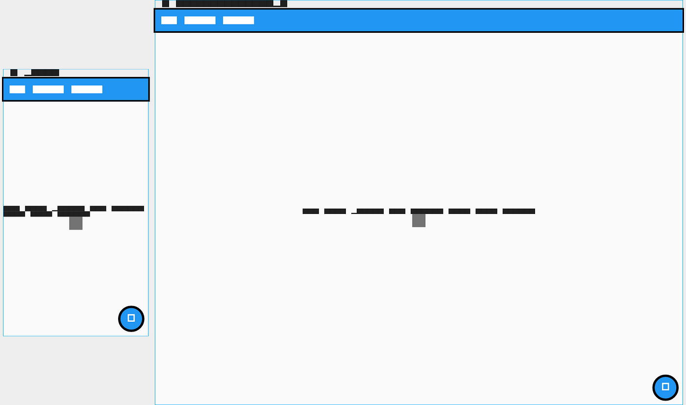
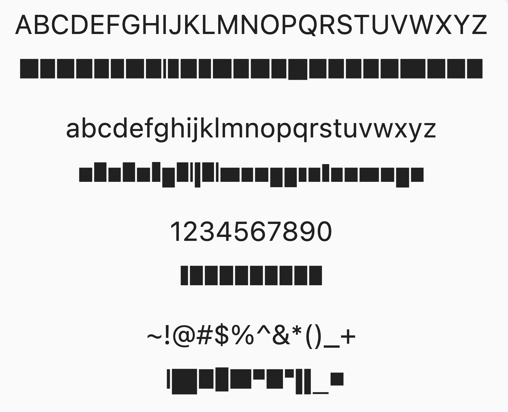

## What are golden tests?
A Flutter golden test is a test that compares actual painted pixels. First, the test generates a verified “good” image, known as a golden. Future test runs compare the new pixels to the golden pixels. If a difference is detected, the test fails.

### The Golden font
Golden tests replace all fonts in your app with a special font called Ahem. The Ahem font renders large squares for every character of text. Rectangles are used for text to avoid curves that might cause irrelevant test failure when comparing pixels.

### What's the problem?
The problem is that Ahem squares don’t reflect the reality of text layout. Short text appears very long, often breaking layouts. Space between characters isn’t visible, which prevents testing caret placement and text selection painting.



--- 

## A better Golden font
The `golden_bricks` package ships a custom font that still uses rectangles like Ahem, but uses rectangles of different sizes to simulate real text layout. Wide characters are wide, narrow characters are narrow, and space between character is still visible.



--- 

## Use Golden bricks
To use the `golden_bricks` font in your tests, there are two steps: load fonts for all tests, tell your text style to use the font.

### Load real fonts in your tests
To easily load fonts in your tests, we recommend using the `golden_toolkit` package. Create/update your Flutter test config file with the following...

```dart
import 'dart:async';
import 'package:golden_toolkit/golden_toolkit.dart';

Future<void> testExecutable(FutureOr<void> Function() testMain) async {
  await loadAppFonts();
  return testMain();
}
```

### Use the font
Use the font in your tests by applying it to `TextStyle`s. The easiest way to do this across your app is to configure the theme that you use in your tests.
```dart
testWidgets("renders in golden tests", (tester) async {
  await tester.pumpWidget(
    MaterialApp(
      theme: ThemeData(
        fontFamily: goldenBricks,
      ),
      home: Scaffold(
        // content
      ),
    ),
  );
  
  // TODO: implement the rest of the test.
});
```

## Built by the Flutter Bounty Hunters
This package was built by the [Flutter Bounty Hunters (FBH)](https://flutterbountyhunters.com). 
The Flutter Bounty Hunters is a development agency that works exclusively on open source Flutter 
and Dark packages.

With funding from corporate clients, the goal of the Flutter Bounty Hunters is to solve 
common problems for The Last Time™. If your team gets value from Flutter Bounty Hunter 
packages, please consider funding further development. 

### Other FBH packages
Other packages that the Flutter Bounty Hunters brought to the community...

[Super Editor, Super Text, Attributed Text](https://github.com/superlistapp/super_editor), [Static Shock](https://staticshock.io), 
[Follow the Leader](https://github.com/flutter-bounty-hunters/follow_the_leader), [Overlord](https://github.com/flutter-bounty-hunters/overlord),
[Flutter Test Robots](https://github.com/flutter-bounty-hunters/flutter_test_robots), and more.

## Contributors
The `golden_bricks` package was built by...

{{ components.contributors() }}